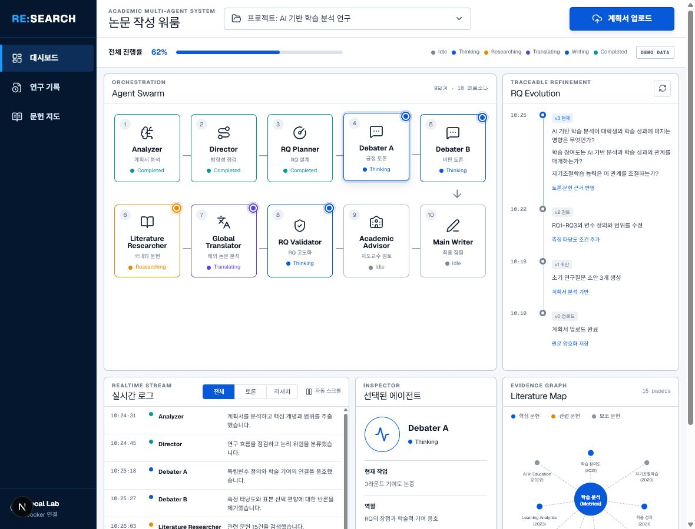
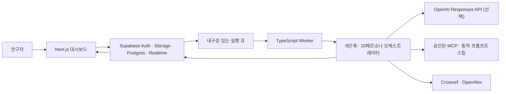

# RE:SEARCH Academic Swarm

계획서를 업로드하면 분석, 방향성 점검, 연구질문 설계, 3라운드 대립 토론, 국내외 문헌 조사, 해외 문헌 번역·분석, RQ 고도화, 지도교수 검토, 최종 원고 작성까지 수행하는 로컬 우선 학술 에이전트 시스템입니다. Next.js 대시보드가 Supabase Realtime 이벤트를 받아 열 개의 페르소나 상태와 연구 산출물을 실시간으로 보여줍니다.



## 구성



- Analyzer → Director → RQ Planner
- Debater A/B가 교대로 정확히 3라운드 토론
- Literature Researcher → Global Translator → RQ Validator
- Academic Advisor → Main Writer
- OpenAI 키가 없으면 결정론적 데모 모델로 전체 파이프라인 실행
- PDF, DOCX, TXT, Markdown 업로드(최대 20 MiB)
- AES-256-GCM 원문/최종 원고 암호화, private Storage, 전 테이블 RLS
- 서명·해시·호스트 허용 목록을 검증하는 프롬프트 전용 동적 스킬 로더

상세 설계는 [설계 문서](docs/superpowers/specs/2026-07-17-academic-swarm-design.md), 구현 근거는 [Fidelity 문서](docs/FIDELITY.md), 보안 경계는 [보안 문서](docs/SECURITY.md)에 있습니다.

## 로컬 실행

필수 조건은 Node.js 24, Docker Desktop, Git입니다. 클라우드 Supabase 프로젝트나 수동 API 키 복사는 필요하지 않습니다.

```powershell
npm install
npm run supabase:start
npm run supabase:env
npm run dev:all
```

- 대시보드: <http://127.0.0.1:3000>
- Supabase Studio: <http://127.0.0.1:54323>
- 로컬 API: <http://127.0.0.1:54321>

`supabase:env`는 실행 중인 로컬 스택에서 URL, publishable key, service-role key, DB URL을 감지하고 새 256-bit 암호화 키를 만들어 Git에서 제외된 `.env`에 기록합니다. 기존 OpenAI 키와 암호화 키는 보존합니다.

Windows에서 Supabase Edge Runtime 컨테이너가 불안정한 환경을 피하기 위해 사용하지 않는 Edge Runtime만 제외합니다. Database, Auth, Storage, Realtime, Studio는 모두 로컬 Docker에서 실행됩니다.

## 주요 명령

| 명령                                           | 용도                                         |
| ---------------------------------------------- | -------------------------------------------- |
| `npm run dev:all`                              | 웹 앱과 durable worker 동시 실행             |
| `npm run worker:once`                          | 대기 중 실행 1건 처리 후 종료                |
| `npm run supabase:reset`                       | 마이그레이션으로 로컬 DB 재구축              |
| `npm run test:db`                              | 17개 pgTAP 스키마·RLS 검증                   |
| `npm run test`                                 | 단위·컴포넌트·통합 테스트                    |
| `npm run test:e2e`                             | Chromium 대시보드 E2E 테스트                 |
| `npm run verify`                               | 포맷, lint, 타입, 테스트, 빌드 릴리스 게이트 |
| `npm run checkpoint -- "feat: 메시지"`         | 검증 후 자동 add/commit/push                 |
| `npm run checkpoint:dry-run -- "feat: 메시지"` | Git 변경 없이 동작 확인                      |

Windows에서는 `./scripts/checkpoint.ps1 "feat: 메시지"`, macOS/Linux에서는 `./scripts/checkpoint.sh "feat: 메시지"`도 사용할 수 있습니다. 현재 원격은 [hyidyong/rework](https://github.com/hyidyong/rework)에 연결되어 있고, 체크포인트는 upstream이 없을 때도 현재 브랜치를 자동 등록합니다.

## 실제 모델·MCP·동적 스킬

데모 모드 대신 실제 모델을 사용하려면 로컬 `.env`의 `OPENAI_API_KEY`만 설정합니다. 서버 측 `OPENAI_MODEL` 기본값은 환경 생성 스크립트에 있으며 필요할 때 교체할 수 있습니다.

```dotenv
MCP_SERVERS_JSON=[{"label":"library","serverUrl":"https://mcp.example.edu/sse","trusted":false}]
SKILL_REGISTRY_ALLOWLIST=mcp.example.edu,skills.example.edu
```

MCP URL은 HTTPS와 허용 호스트를 통과해야 합니다. 신뢰되지 않은 서버의 도구 호출은 승인 필수로 모델에 전달합니다. 동적 스킬은 실행 코드를 내려받지 않고, 크기·SHA-256·역할 호환성을 검증한 프롬프트만 저장합니다.

## 데이터와 Git 안전성

권위 있는 DB 정의는 `supabase/migrations/`이고 루트 `schema.sql`은 동일 스키마를 한 파일로 제공합니다. `.env`, 로컬 Supabase 상태, 테스트 결과, 빌드 산출물은 커밋하지 않습니다. 브라우저 Realtime에는 원문이나 비밀 대신 정제된 요약 이벤트만 노출됩니다.

GitHub Actions는 푸시와 PR마다 로컬 Supabase를 띄우고 pgTAP, 포맷, lint, 타입, 단위/통합 테스트, 프로덕션 빌드, high/critical 의존성 검사, Chromium E2E, Gitleaks를 수행합니다.

사람이 직접 판단해야 하는 항목만 [TODO_HUMAN.md](TODO_HUMAN.md)에 남겨 두었습니다.
