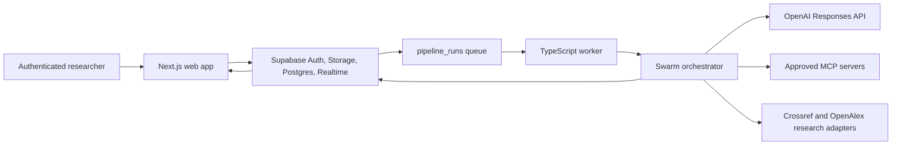

# Academic Paper Swarm Design

## Outcome

Build a production-oriented research workroom in which an authenticated researcher uploads a proposal, a durable worker coordinates ten visible agent nodes across nine academic roles, and Supabase streams progress, debate, research evidence, refined research questions, advisor feedback, and the final paper to a Next.js dashboard.

The accepted visual specification is [`docs/design/research-war-room-concept.png`](../../design/research-war-room-concept.png).

## Approaches considered

1. **All-in-one Next.js route** — smallest deployment surface, but long academic runs would be tied to HTTP request lifetimes and are vulnerable to serverless timeouts.
2. **Next.js application plus durable TypeScript worker (selected)** — the web application owns authentication, uploads, and visualization; a separate process atomically claims queued runs and owns orchestration. This is locally runnable and can be deployed to any long-running Node host while Supabase remains the shared state plane.
3. **Supabase Edge Functions only** — close to the database, but long-running multi-turn debates, document parsing, and arbitrary MCP transports are a poor fit for short-lived Deno functions.

## System boundaries

- `src/app` contains the App Router UI and authenticated route handlers.
- `src/components` contains the visual system extracted from the accepted concept.
- `src/lib` contains environment validation, encryption, Supabase clients, document parsing, research adapters, and shared domain types.
- `src/swarm` contains role prompts, the model gateway, the deterministic workflow, persistence ports, and retry policy.
- `worker/runner.ts` claims queued runs and invokes the workflow outside the web request lifecycle.
- `supabase/migrations` is the authoritative database and RLS history.

## Workflow

1. The web route validates a PDF, DOCX, Markdown, or text proposal (20 MB maximum), authenticates the caller, stores the original in a private bucket, extracts text, encrypts it with AES-256-GCM, creates a proposal, and enqueues a run.
2. The worker atomically claims one pending run with `FOR UPDATE SKIP LOCKED`, inserts all agent status rows, and starts the Analyzer.
3. Analyzer, Director, and RQ Planner produce typed JSON outputs. Every state transition and safe summary becomes a realtime event.
4. Debater A and Debater B alternate for three complete rounds. The database constraint requires turns 1–6 and preserves speaker order.
5. Literature Researcher queries OpenAlex and Crossref and can use hosted web search. Global Translator produces Korean translations and analytical notes without copying full copyrighted papers.
6. RQ Validator produces a new version linked to its predecessor. Academic Advisor evaluates novelty, validity, feasibility, ethics, evidence, and writing quality.
7. Main Writer composes a structured Markdown paper with citations. The encrypted full paper is stored separately from its realtime-safe abstract.
8. Failures are retried with bounded exponential backoff. A run that exhausts retries is marked failed with a safe error code, while secret-bearing exception text remains server-side only.

## Agents and prompts

Ten displayed nodes implement nine roles because the debate role has two independent personas. Each prompt is a versioned Markdown file with a strict output schema, role boundary, evidence rules, and prohibition against inventing sources.

- Analyzer: proposal summary, concepts, scope, assumptions, candidate methods.
- Director: academic contribution, validity, feasibility, ethics, logic gaps.
- RQ Planner: measurable and answerable initial questions.
- Debater A: strongest support, contribution, expected impact.
- Debater B: strongest counterargument, bias, confounding, method weakness.
- Literature Researcher: domestic/international search strategy and verifiable metadata.
- Global Translator: Korean translation and critical synthesis of foreign sources.
- RQ Validator: versioned revision with change rationale.
- Academic Advisor: rubric-based final critique and actionable corrections.
- Main Writer: academic Markdown manuscript grounded only in recorded evidence.

## Data model

Required tables are `proposals`, `agent_status`, `rq_records`, `debate_logs`, `research_papers`, `advisor_feedbacks`, and `final_papers`. Supporting tables are `pipeline_runs`, `agent_events`, and `skill_registry`.

Every user-owned row includes `owner_id`; every foreign key is indexed; frequently streamed rows use `(proposal_id, created_at, id)` indexes. All public-schema tables enable RLS and grant only the operations the browser needs. The worker alone uses the service role. Realtime publication includes status/event/RQ/debate/research/feedback/final-summary tables, never encrypted proposal or manuscript payloads.

## MCP and dynamic skills

The model gateway supports OpenAI remote MCP tools declared through a validated `MCP_SERVERS_JSON` configuration. Servers must use HTTPS, match an allowlist, and default to approval-required for write-capable tools. A dynamic skill loader accepts signed JSON manifests containing prompt-only skills, validates their SHA-256 digest, size, role compatibility, and source host, then stores the prompt in `skill_registry`. It never downloads executable code.

Local, version-controlled prompt files remain the fallback so the system works without an external registry.

## Security

- Supabase SSR uses publishable credentials in the browser and verifies identity again in every route handler with `getUser()`/`getClaims()` semantics; proxy redirects are convenience, not authorization.
- The service-role key, OpenAI key, encryption key, and MCP credentials are server-only environment variables.
- Proposal text and final manuscripts use AES-256-GCM with a 32-byte base64 key and random 96-bit IVs. Associated data binds ciphertext to the owner and proposal ID.
- Private Storage policies require the first path segment to equal `auth.uid()`.
- RLS ownership predicates use `(select auth.uid()) = owner_id`; update policies include `USING` and `WITH CHECK`.
- Upload MIME, extension, byte size, extracted-text size, URLs, model outputs, and remote skill manifests are validated with Zod.
- Logs are structured and redact tokens, authorization headers, and source text.

## Dashboard design system

The concept uses a deep ink navigation rail, true-white workspace, cool paper panels, cobalt active states, amber research states, violet translation states, teal completion states, and crimson only for failures. It uses 1 px borders, 10–14 px radii, restrained shadows, open rails/lists/canvas layouts, and Korean-compatible sans-serif UI typography with mono timestamps.

Primary regions are `NavRail`, `CommandBar`, `ProgressStrip`, `AgentPipeline`, `LiveLog`, `SelectedAgentPanel`, `RQTimeline`, and `LiteratureMap`. Active agents pulse unless `prefers-reduced-motion` is enabled. The right rail moves below the main canvas on tablets and the navigation condenses on mobile.

## Testing and acceptance

- Unit tests cover environment parsing, encryption round trips/tamper rejection, upload validation, role schemas, debate turn order, retry transitions, citation normalization, and skill-manifest integrity.
- Component tests cover status presentation, log filters, RQ history, upload behavior, accessibility names, and reduced motion.
- SQL tests verify required tables, constraints, indexes, realtime publication membership, and cross-user RLS isolation.
- An integration test runs the complete pipeline against an in-memory persistence adapter and deterministic model fixture.
- Playwright verifies login/demo entry, upload, live status change, debate filtering, RQ evolution, and final-paper access.
- Release gates are `npm test`, `npm run lint`, `npm run typecheck`, `npm run build`, and `npm run test:e2e`.

## Human-only operations

Hosted Supabase project creation can incur cost and requires organization selection, so local Supabase is the default development backend. Hosted project selection/creation, OAuth/API keys, domain redirects, and any paid literature database credentials are documented in `TODO_HUMAN.md`; no secret is placed in Git or chat.
